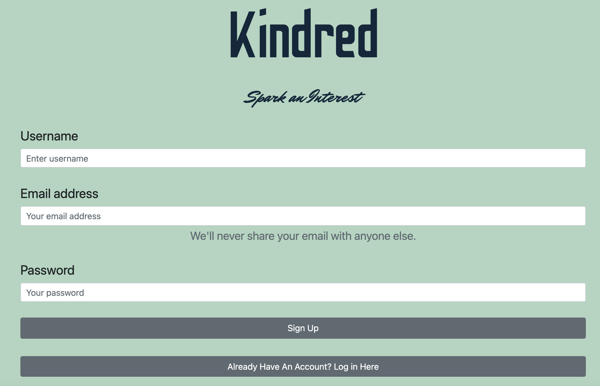
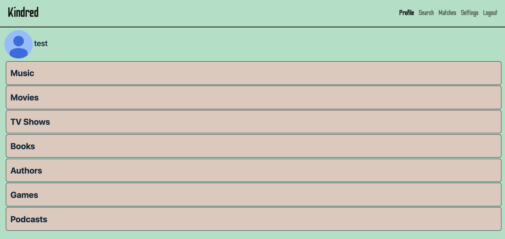
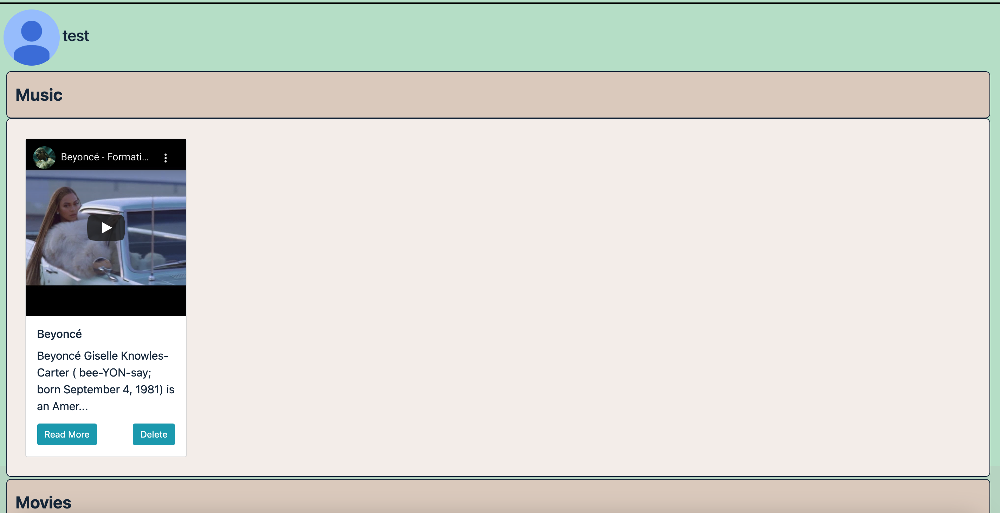
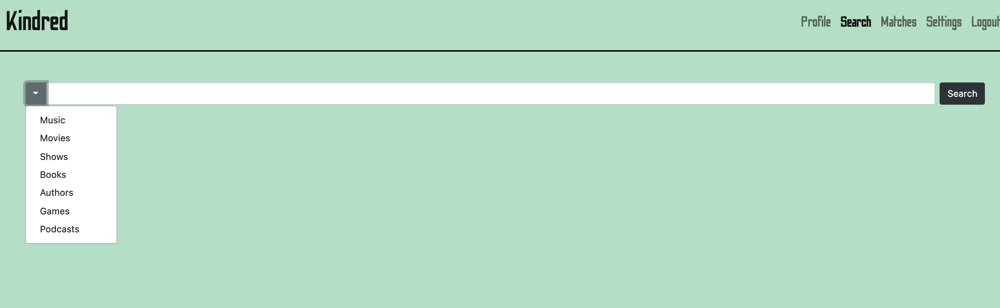
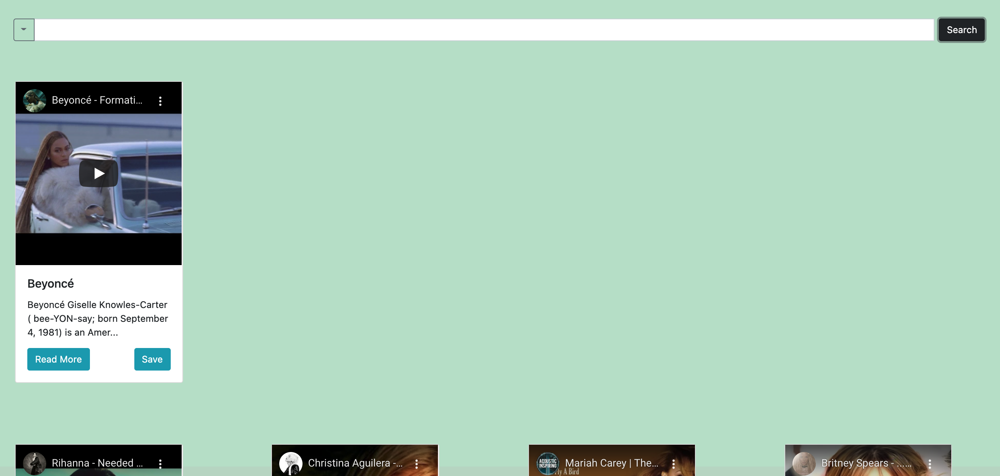
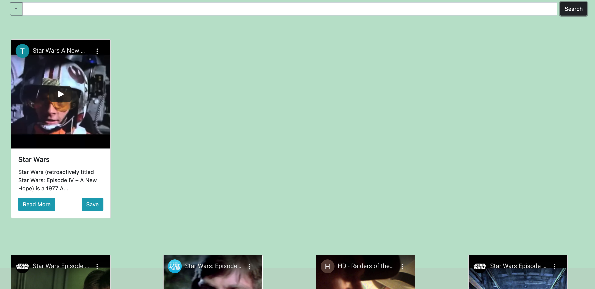
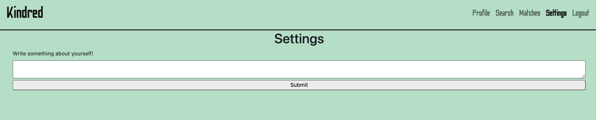

# Kindred App
    
## Table of Contents
* [Description](#description) 
* [Installation](#installation)
* [Usage](#usage)
* [Images](#Images)
* [Credits](#credits)
* [License](#license)
* [Badge](#badge)
* [Questions](#questions)
    
## Description
* New dating App that uses common interests between individuals and will allow for chats between them to spark interest.  Users can save interests in books, movies, games, podcasts, etc to their profiles and then see matches based on those interests.
    
## Installation
* no installation necessary.  application is web based and can be accessed with any modern web browser.
    
## Usage
* Access the website, https://kindred-app.herokuapp.com/, and either create an account or log in to your account.  From there, you can use the navigation menu at the top of the screen to view your saved interests, search for new interests, review your matches, update your profile under settings or log out once you are finished.  Under search, you use the drop down menue on the left of the search screen to pick your category then type in a specific book, movie, game, etc to search for.  Once you have your results, you can save the results to your profile or read more about them (this will take you to their wiki page).  You can also remove interests from your profile by select remove from the specific interest you want to remove.  
    
## Images

 

 

 

 

 

## Credits
* Salome Ranson, Braxton Bodenhamer, and Karen Roh
    
## License
* Licensed by mit
    
## Badge
* 
    
## Questions
* For any questions, concerns, or additional help, please contact klucas72@hotmail.com, salomeranson@gmail.com, karenroh@hotmail.com, and braxb92@gmail.com.
